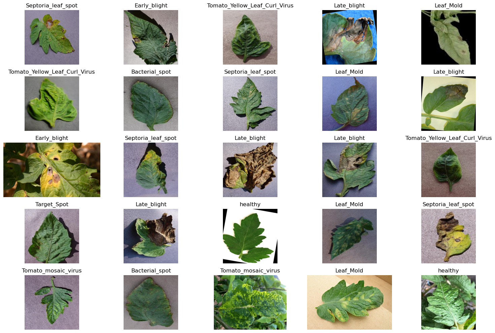

<h1 align='center'> Disease Detection in Leaves </h1> 
<h2 align='center'> Pytorch Lightning + W&B Tracking </h2>

<p align='center'></p>
<p align='center'>


</p>

## Introduction 

This repository contains the code for disease classification in a agro-crop. Data augmentation is performed using Albumentations library is training is performed using PyTorch Lightning framework. 

## Training

### 1. Installing the dependencies

To run the code in this repository, few frameworks need to be installed in your machine. 
Make sure you have enough space and stable internet connection.

Run the below command for installing the required dependencies.

```shell
$ pip install -r requirements.txt
```
### 2. Get the data

Data can retreived from the public datasets like Plant Village Dataset. For more information [visit here](https://www.tensorflow.org/datasets/catalog/plant_village)

Now, take the downloaded `.zip` file and extract it into the new folder `input/`.

Take care that the `input/` folder is at same directory level as `train.py` file.

### 3. Training the model

If you have the above steps right then, running the train.py should not produce any errors. 
To run the code, open the terminal and change the directory level same as `train.py` file. 
Now run the `train.py` file.

```shell
$ python train.py
```
You should start seeing the progress bar, on few seconds at the beginning of training.
If you have any problem, feel free to open a Issue. Will be happy to help.


